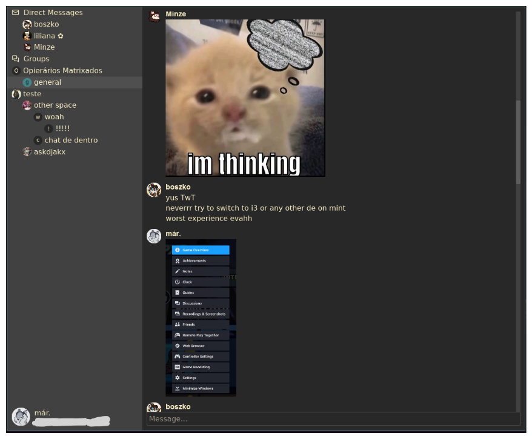

<h1 align="center">❄️ Opie 🦀</h1>



<p align="center">Pure Rust Matrix GUI client.</p>

---

Currently, the app is still a WIP. Here's the features that are planned/completed:
- [x] Authentication
- [x] Device SAS verification (both sending and receiveing)
- [x] Receiveing messages
- [x] Room listing and spaces navigation
- [x] Sending messages
- [ ] Sticker support
- [ ] Poll support
- [ ] Voice message support
- [ ] Notifications
- [ ] Custom theming
- [ ] Settings

# Project structure
This is an [iced](https://github.com/iced-rs/iced) application, using the [Matrix Rust SDK](https://github.com/matrix-org/matrix-rust-sdk) to interact with the Matrix servers. You can find anything related to the Matrix SDK in the [`matrix`](matrix) folder.

This project relies heavily on async code. So the GUI interacts with the SDK using two MPSC channels: one where the GUI sends `Actions` and one where the SDK can send `Events` back to the GUI, like `Messages` in the Elm Architecture.

# Local development
The app contains a `debug` feature flag, you can run with it using the following:
```
$ cargo run --features debug
```
The `debug` feature flag allows for time travel debugging, as well as other debug features `iced` provides.
